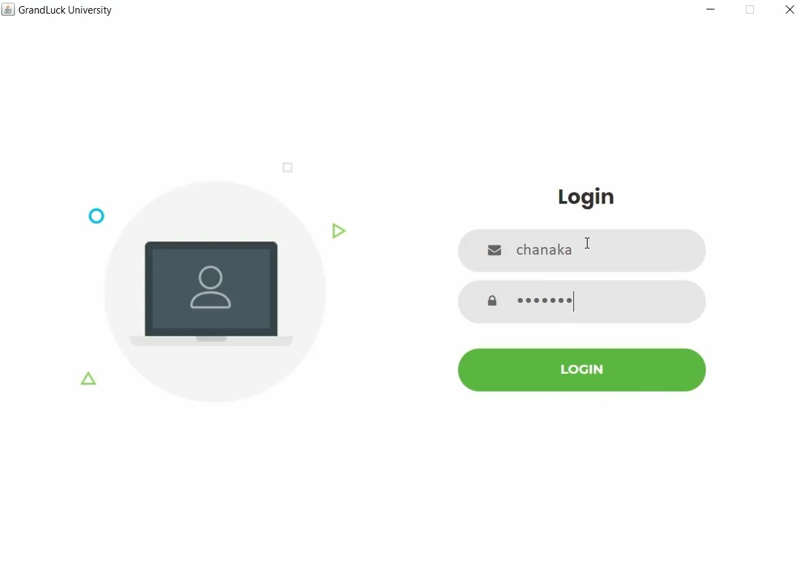
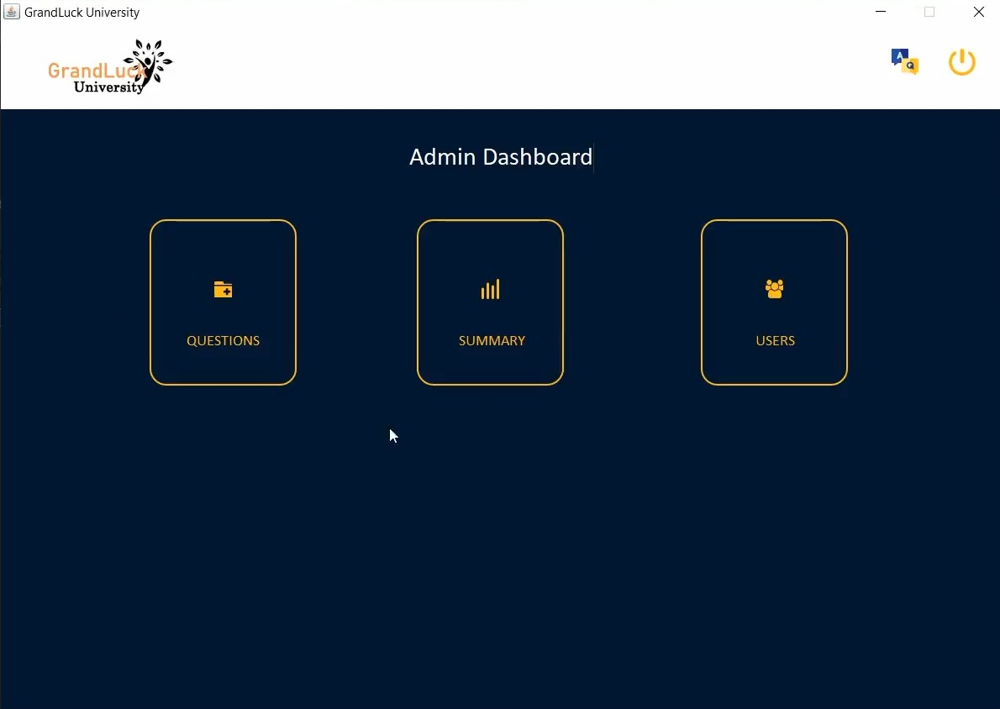
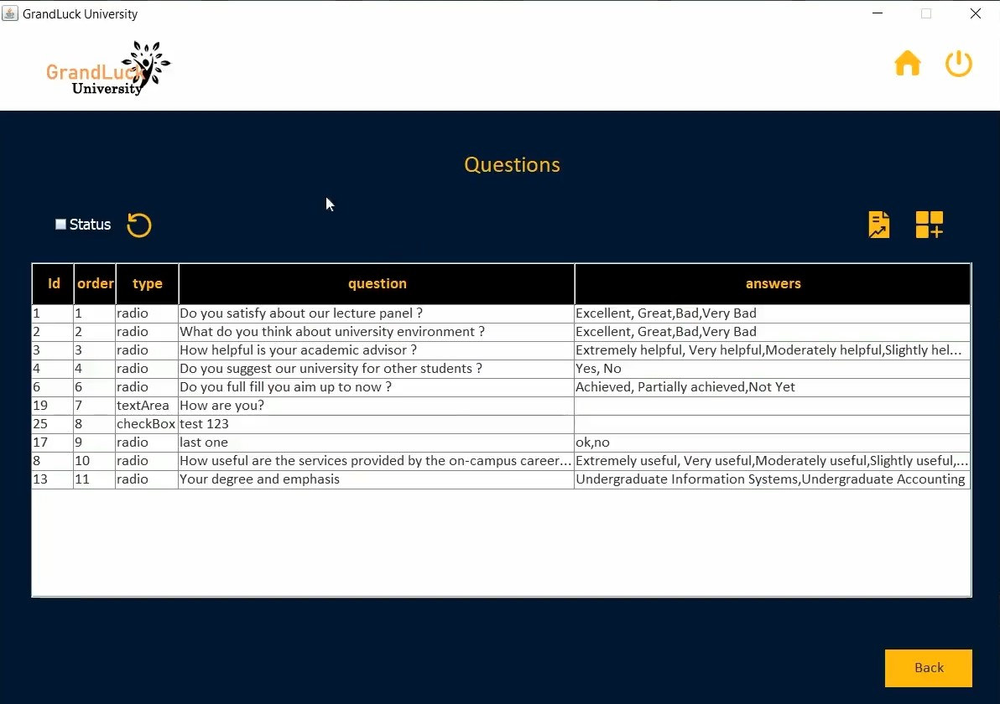
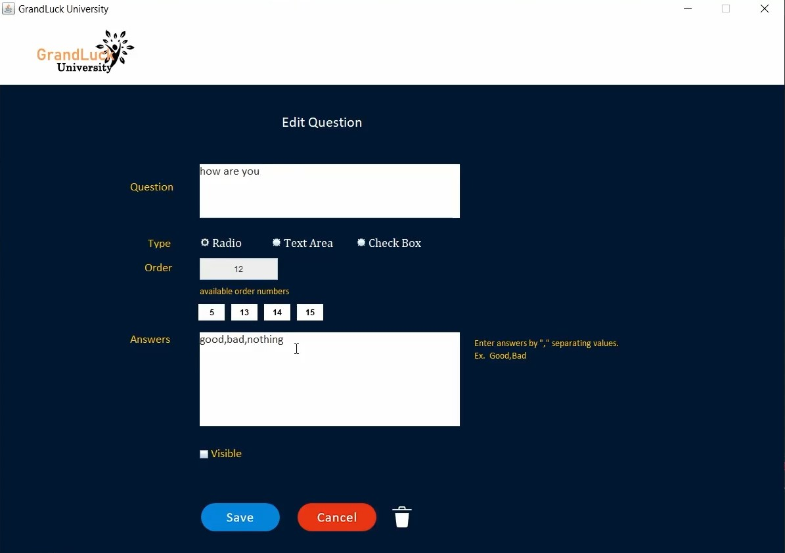
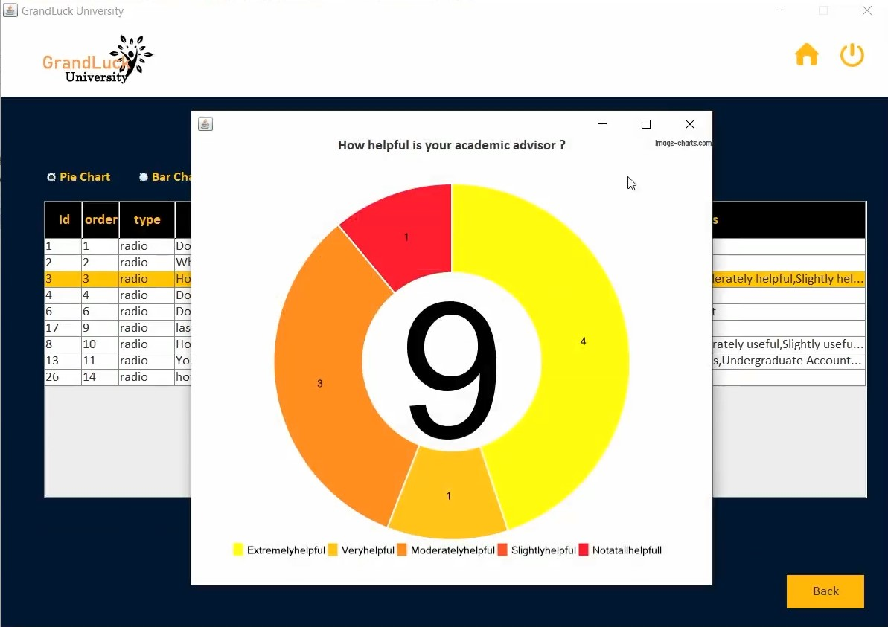
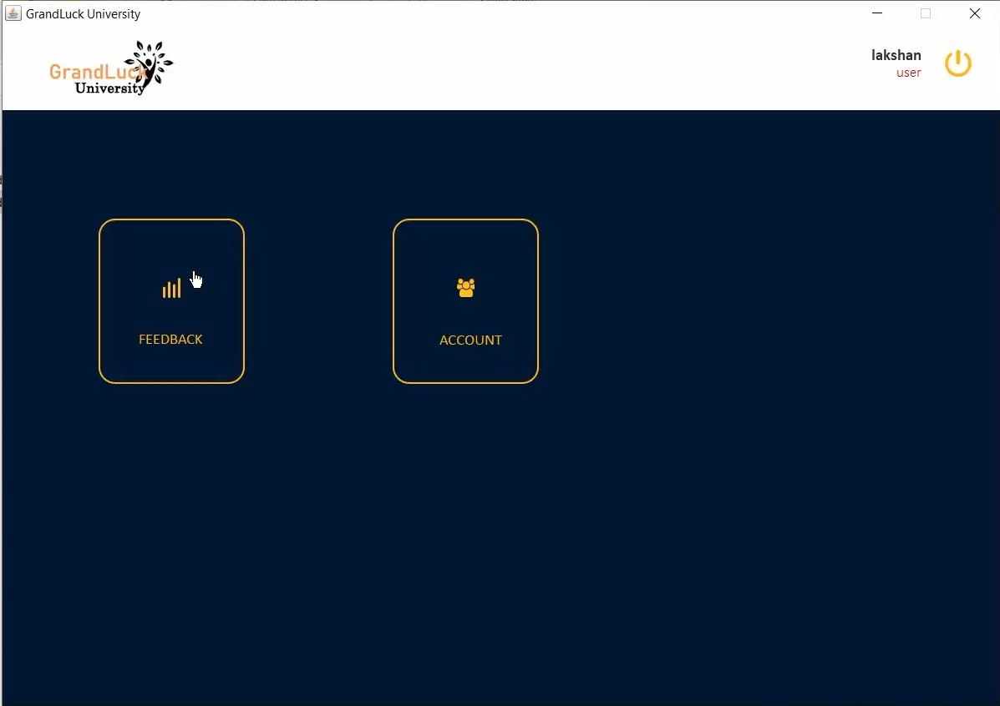
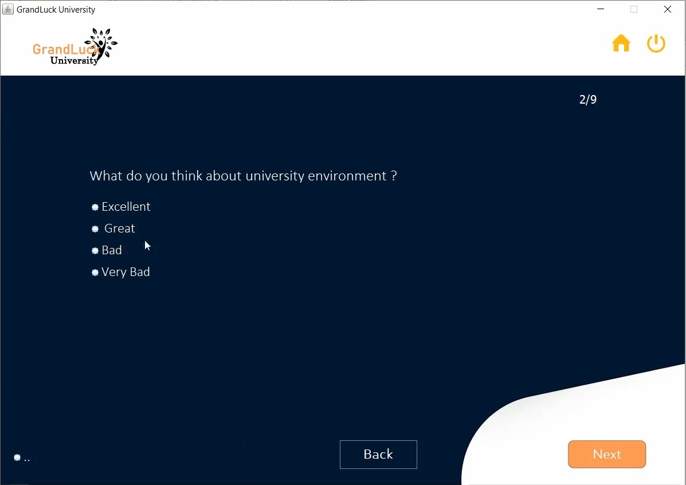
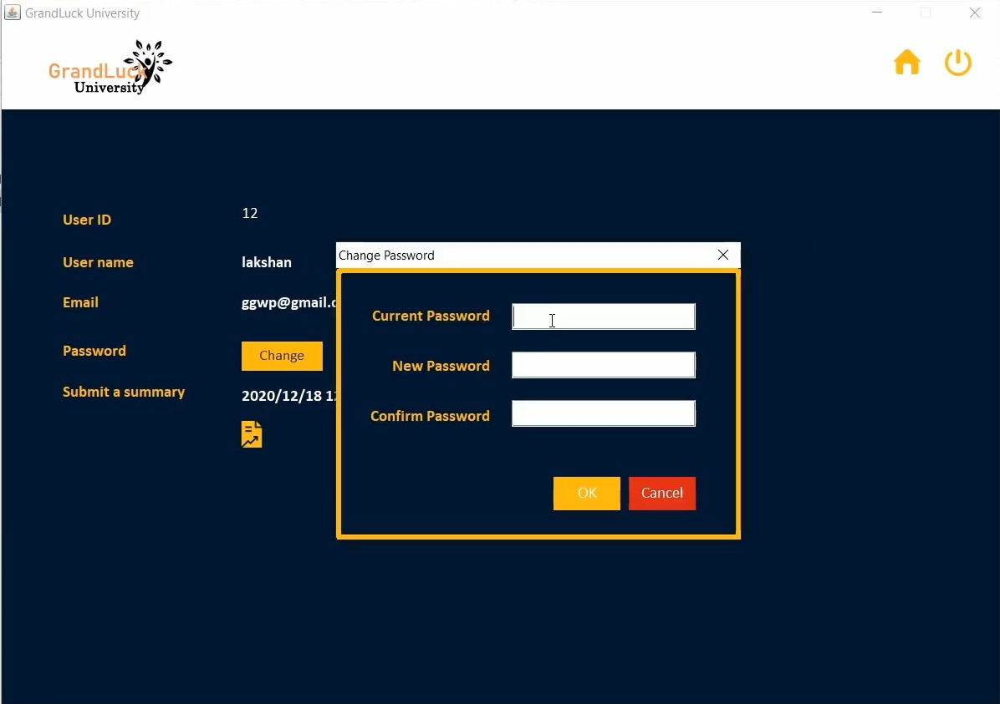

# JavaRMI_Project_client

In this project, I was tasked with collecting university feedback for my university ( UOB - University of Bedfordshire ) as a part of the CIS course. ( Java desktop application - frontend )

this is the backend project github => https://github.com/galactusclb/JavaRMI_Project_server

### Login Details

User login details :  
&nbsp;&nbsp;&nbsp; username : chanaka  
&nbsp;&nbsp;&nbsp; password : Chanaka123@  
&nbsp;&nbsp;&nbsp; role: admin  

 

 

# Technologies

 

# Screenshots

### Login page

  

   

### Admin dashboard

  

   

### Admin questions list page

  

   

### Admin questions edit page

  
  
   

### Admin questions summary reports

  

   

### Student dahsboard page

  

   

### Student feedback page

  

   

### User change password page

  

   
   

# Contributing

Pull requests are welcome. For major changes, please open an issue first to discuss what you would like to change.

 

---

> Happy cording 🥰
